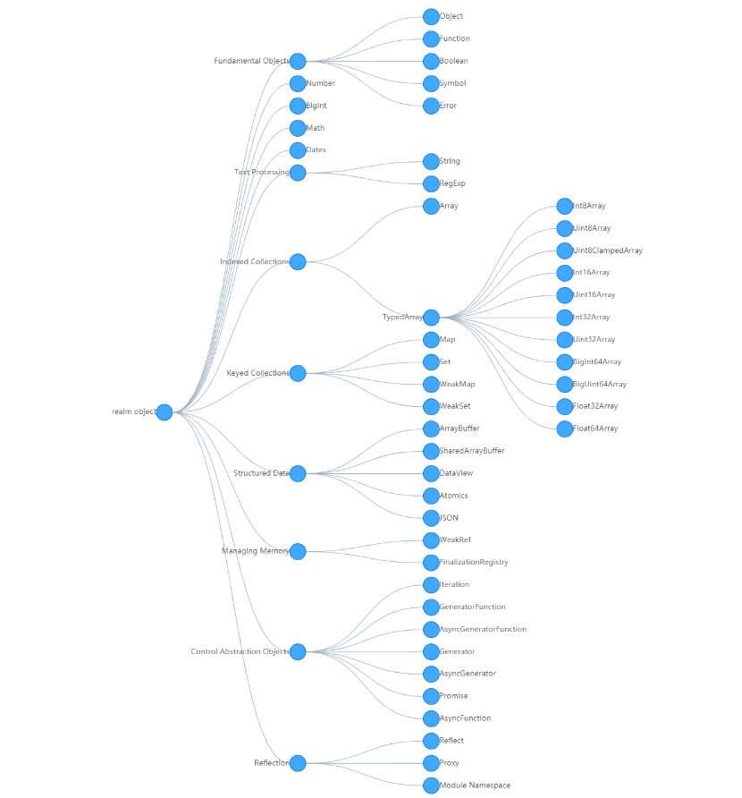

学习笔记

## 1、Realm
什么是`Realm`？es规范里这么说的:`Before it is evaluated, all ECMAScript code must be associated with a realm. Conceptually, a realm consists of a set of intrinsic objects, an ECMAScript global environment, all of the ECMAScript code that is loaded within the scope of that global environment, and other associated state and resources`，翻译过来就是：在解析运行时，所有ECMAScript代码都必须与一个领域相关联。 从概念上讲，领域由一组内部对象，一个ECMAScript全局环境，在该全局环境范围内加载的所有ECMAScript代码以及其他相关状态和资源组成。

### 1.2、[Realm中的实例原型对象](https://tc39.es/ecma262/#sec-fundamental-objects)
* Fundamental Objects
  * Object
  * Function
  * Boolean
  * Symbol
  * Error
* Number
* BigInt
* Math
* Dates
* Text Processing
  * String
  * RegExp
* Indexed Collections
  * Array
  * TypedArray
    * Int8Array
    * Uint8Array
    * Uint8ClampedArray
    * Int16Array
    * Uint16Array
    * Int32Array
    * Uint32Array
    * BigInt64Array
    * BigUint64Array
    * Float32Array
    * Float64Array
* Keyed Collections
  * Map
  * Set
  * WeakMap
  * WeakSet
* Structured Data
  * ArrayBuffer
  * SharedArrayBuffer
  * DataView
  * Atomics
  * JSON
* Managing Memory
  * WeakRef
  * FinalizationRegistry
* Control Abstraction Objects
  * Iteration
  * GeneratorFunction
  * AsyncGeneratorFunction
  * Generator
  * AsyncGenerator
  * Promise
  * AsyncFunction
* Reflection
  * Reflect
  * Proxy
  * Module Namespace

### 1.3、使用G6可视化绘制原型对象图

## 2、表达式、语句
### 2.1 [运算符优先级](https://developer.mozilla.org/zh-CN/docs/Web/JavaScript/Reference/Operators/Operator_Precedence)
由高到低：
* Member 属性访问
  * a.b
  * a[b]
  * super.b
  * super['b']
  * new.target
  * new Foo()
* new
* ..++
* ..--
* 运算符
  * 逻辑非！
  * 按位非~
  * 一元加法+
  * 一元减法-
  * 前置递增++..
  * 前置递减--..
  * typeof
  * delete
  * await
* 幂
* 乘法
* 除法
* 取模
* 加法
* 减法
* 按位左移动
* 按位右移
* 关系运算符：< > <= >= in instanceof
* 相等判断运算符：== != === !==
* 位运算
* 逻辑或与
* 条件运算符
* 赋值
* yield
* 展开运算符
* 逗号

### 2.2 语句
简单语句：
* ExpressionStatement
* EmptyStatement
* DebuggerStatement
* ThrowStatement
* ContinueStatement
* BreakStatement
* ReturnStatement
复合语句：
* BlockStatement
* Iteration
* while
* do…while
* for
* for…in
* for…of
* break、continue
声明语句

## 3、宏任务和微任务
js执行粒度，有高层级到底层级：
* 宏任务
* 微任务
* 函数调用
* 语句/声明
* 表达式
* 直接量/变量/this